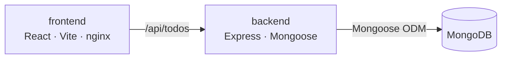

## Repository structure

```text
├── src/                    # React frontend, Express backend, MongoDB compose stack
├── terraform/              # AWS infra modules + dev/uat env services
├── k8s-infra-aws-ssm/      # Kubernetes manifests for EKS deployment
├── script/                 # Deployment helper scripts
```

## Application

`src/` contains local application source and `compose.yaml`.

- `src/frontend/` — React client built with Vite, served by nginx in production.
- `src/backend/` — Express API service using Mongoose.
- `src/compose.yaml` — local frontend, backend, MongoDB stack.
- `src/frontend/Dockerfile-local` — frontend image for local deployment.
- `src/backend/Dockerfile-local` — backend image for local deployment.

API routes:

| Method | Path | Purpose |
| --- | --- | --- |
| `GET` | `/api` | List todos |
| `POST` | `/api/todos` | Create todo |
| `DELETE` | `/api/todos/:id` | Delete todo |

## Local development

From `src/`:

```bash
docker compose up --build
```

Local deployment uses the frontend and backend `Dockerfile-local` files:

```yaml
services:
  frontend:
    build:
      context: frontend
      dockerfile: Dockerfile-local
      target: development
  backend:
    build:
      context: backend
      dockerfile: Dockerfile-local
      target: development
```

Frontend package commands:

```bash
cd src/frontend
npm start
npm run build
npm test
```

Backend package commands:

```bash
cd src/backend
npm start
npm run dev
```

## Infrastructure

`terraform/` defines AWS infrastructure with environment services and reusable modules.

Dev services include:

- Networking
- ECR repositories
- EKS cluster
- EKS post-install resources
- AWS Load Balancer Controller
- SSM-backed secrets

Reusable modules include bootstrap state, networking, EKS, ECR, ALB controller, and public access allowlist.

## Kubernetes deployment

**`k8s-infra-aws-ssm-dev-uat/`** — dev and UAT overlays on a shared EKS cluster. Contains:

| Directory | Contents |
| --- | --- |
| `frontend/` `backend/` | Deployment, Service, HPA per env (dev/uat) |
| `mongo/` | StatefulSet, Service, app-user job, rotation CronJobs/RBAC, scripts |
| `external-secrets/` | SecretStore + ExternalSecret resources backed by AWS SSM |
| `ingress-dev.yaml` `ingress-uat.yaml` | ALB Ingress (shared IngressGroup with monitor services) |
| `prometheus/` `grafana/` `loki/` `alloy/` | Observability stack in `monitor` namespace |
| `metrics-server/` | Cluster metrics for HPA |
| `cluster-autoscaler/` | Node scaling via ASG tag discovery |
| `namespace.yaml` `storageclass-gp3.yaml` | Namespaces and gp3 StorageClass |

**`k8s-infra-aws-ssm-prod/`** — prod overlay on a separate EKS cluster. Contains:

| Directory | Contents |
| --- | --- |
| `frontend/` `backend/` | Deployment, Service, HPA |
| `mongo/` | StatefulSet, Service, app-user job, rotation CronJobs/RBAC, scripts |
| `external-secrets/` | ClusterSecretStore + ExternalSecret resources backed by AWS SSM |
| `ingress-prod.yaml` | ALB Ingress (standalone, no shared group) |
| `prometheus/` `grafana/` `alloy/` | Metrics/logs shipped to dev cluster; dashboards rendered there |
| `namespace-prod.yaml` `storageclass-gp3.yaml` | Namespace and gp3 StorageClass |

Each overlay has its own `kustomization.yaml` and `README.md` with full architecture, routing, storage, and scheduling details.

### Deploy

```bash
script/deploy-eks-aws-ssm-react.sh dev     # dev/UAT cluster
script/deploy-eks-aws-ssm-react.sh prod    # prod cluster (separate EKS)
```

### ALB DNS

```bash
# dev/UAT
kubectl get ingress demo-react-eks -n dev -o jsonpath='{.status.loadBalancer.ingress[0].hostname}'

# prod
kubectl --context eks-react-prod get ingress elb-react-eks-prod -n prod -o jsonpath='{.status.loadBalancer.ingress[0].hostname}'
```

## Deployment scripts

`scripts/` is not used; helper scripts live in `script/`:

| Script | Purpose |
| --- | --- |
| `deploy-infra-eks-aws-ssm-react.sh` | Deploy Terraform infrastructure, images, and Kubernetes manifests |
| `deploy-img-fe-be-ecr-aws.sh` | Build and push frontend/backend images to ECR |
| `deploy-img-backend-aws.sh` | Build and push backend image to ECR |
| `deploy-img-frontend-aws.sh` | Build and push frontend image to ECR |
| `deploy-ssm-grafana-dashboards.sh` | Deploy Grafana dashboard data |

Common required tools:

- AWS CLI
- Docker with Buildx
- kubectl
- Terraform
