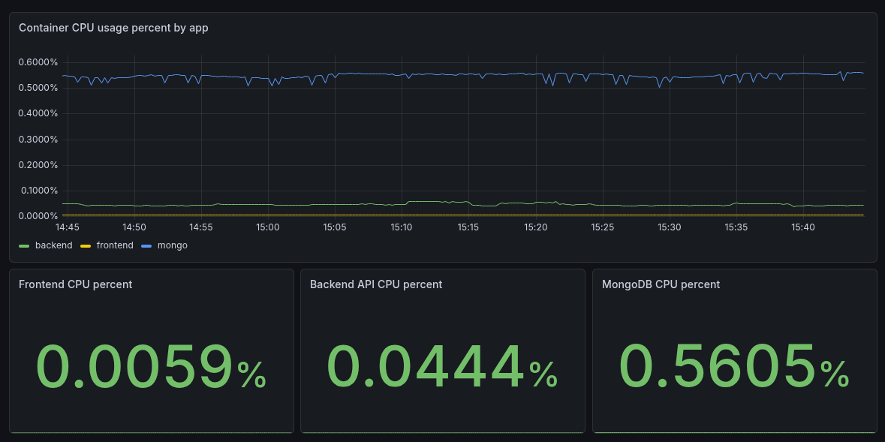
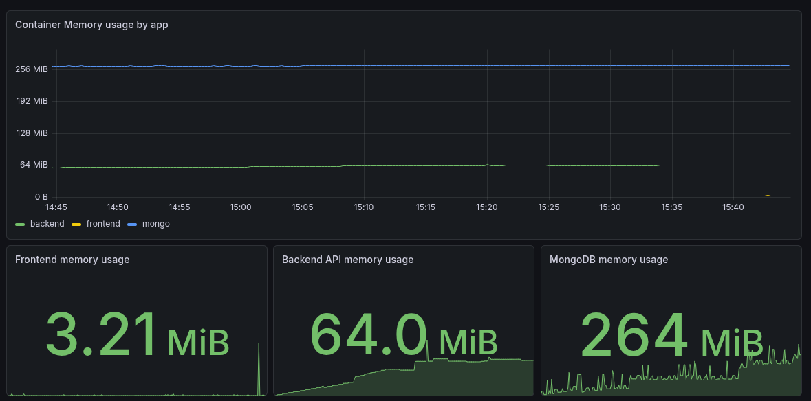
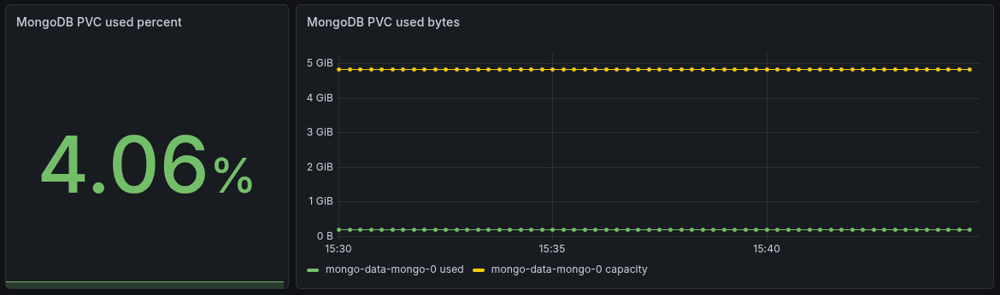

# k8s-infra-aws-ssm-dev-uat





AWS EKS manifests for the dev and UAT environments of the React + Express + MongoDB app.

## Namespaces

- `dev` — dev app workloads
- `uat` — uat app workloads
- `monitor` — shared observability stack (Grafana, Prometheus, Loki, Alloy)

## Architecture

| Component | Image | Replicas | Notes |
|-----------|-------|----------|-------|
| Backend (dev) | `demo-backend:local` → ECR `dev-demo-backend:latest` | HPA 1-4 | RollingUpdate, requests 150m CPU / 256Mi memory, limits 500m CPU / 512Mi memory, probes on :3000 |
| Frontend (dev) | `demo-frontend:local` → ECR `dev-demo-frontend:latest` | HPA 1-4 | Requests 100m CPU / 128Mi memory, limits 300m CPU / 256Mi memory, probes on :3000 |
| Backend (uat) | `demo-backend:local` → ECR `uat-demo-backend:latest` | HPA 1-4 | Same resource profile as dev |
| Frontend (uat) | `demo-frontend:local` → ECR `uat-demo-frontend:latest` | HPA 1-4 | Same resource profile as dev |
| MongoDB | `mongo:8.0.23` | 1 (StatefulSet) | PVC 5Gi gp3, affinity `workload=stateful` + `us-east-1a`, toleration `workload=stateful:NoSchedule` |
| Prometheus | `prom/prometheus:v3.5.1` | 1 | 7d retention, basic auth via nginx sidecar on :8080, remote-write receiver enabled |
| Grafana | `grafana/grafana:13.0.2` | 1 | AZ-pinned `us-east-1a`, datasources + dashboards via ConfigMaps |
| Grafana Image Renderer | `grafana/grafana-image-renderer:v4.1.5` | 1 | ClusterIP renderer, requests 200m CPU / 384Mi memory, limits 1 CPU / 1Gi memory |
| Loki | `grafana/loki:3.7.2` | 1 | PVC 5Gi, retention 168h, auth enabled, ingress on :3100 |
| Grafana Alloy | `grafana/alloy:v1.16.2` | DaemonSet | Tails logs from `/var/log/pods` in `dev`, `uat`, and `monitor`; pushes to Loki |
| Metrics Server | `registry.k8s.io/metrics-server/metrics-server:v0.8.1` | 1 | Cluster metrics for HPA |
| Cluster Autoscaler | `registry.k8s.io/autoscaling/cluster-autoscaler:v1.35.0` | 1 | Node scaling via ASG tag discovery |

## Apply

Manifests contain the placeholder `__AWS_ACCOUNT_ID__` and ALB security-group sentinels that must be rendered before apply. Use the deploy script or the render helper:

```bash
# Full deploy (builds images, renders, applies)
script/deploy-eks-aws-ssm-react.sh dev

# Render only and pipe to kubectl
script/render-k8s.sh k8s-infra-aws-ssm-dev-uat | kubectl apply -f -
```

ECR image names are rewritten via the Kustomize `images:` block to:

```text
__AWS_ACCOUNT_ID__.dkr.ecr.us-east-1.amazonaws.com/{dev,uat}-{demo-backend,demo-frontend,mongo-rotator}:latest
```

## ALB Ingress

Exposed via AWS Load Balancer Controller with dynamic security-group injection:

- SG IDs injected at deploy time by `script/deploy-eks-aws-ssm-react.sh` — manifests store `PLACEHOLDER_FRONTEND_SG,PLACEHOLDER_BACKEND_SG` as sentinels.
- No hardcoded SG IDs in source.
- Certificate ARN in each ingress uses `__AWS_ACCOUNT_ID__` and is substituted by `script/render-k8s.sh`.

```bash
# Get ALB DNS
kubectl get ingress demo-react-eks -n dev -o jsonpath='{.status.loadBalancer.ingress[0].hostname}'

# DNS records
dev-react-eks.h0m3.xyz  CNAME <ALB DNS hostname>
uat-react-eks.h0m3.xyz  CNAME <ALB DNS hostname>  (shared DEV/UAT ALB)
```

### Shared IngressGroup contract

All five ingresses share one ALB via `alb.ingress.kubernetes.io/group.name: demo-react-eks-dev`:

| Ingress | Namespace | `group.order` |
|---------|-----------|---------------|
| `demo-react-eks` | dev | 1 |
| `grafana` | monitor | 2 |
| `prometheus` | monitor | 3 |
| `loki` | monitor | 4 |
| `demo-react-eks-uat` | uat | 4 |

AWS Load Balancer Controller merges every ingress in the same group into one ALB. Every member must carry **identical** merge-sensitive annotations or the controller raises a `conflicting tag` reconcile error.

Required identical values across all group members:

| Annotation | Value |
|---|---|
| `alb.ingress.kubernetes.io/tags` | `Project=demo-eks-dev,Environment=shared,ManagedBy=kubernetes,Name=elb-react-eks-dev-uat` |
| `alb.ingress.kubernetes.io/load-balancer-name` | `elb-react-eks-dev-uat` |
| `alb.ingress.kubernetes.io/subnets` | `subnet-0ca21f0f484edd27d,subnet-0d5b19984b533f703` |
| `alb.ingress.kubernetes.io/certificate-arn` | `arn:aws:acm:us-east-1:__AWS_ACCOUNT_ID__:certificate/ed9119c0-c6a7-49ac-84cf-ded38b29491c` |

Per-member values that may differ: `group.order`, `healthcheck-path`, host rule, target service/port.

## Routing

| Host | Path | Backend |
|------|------|---------|
| `dev-react-eks.h0m3.xyz` | `/api` | `dev/backend:3000` |
| `dev-react-eks.h0m3.xyz` | `/` | `dev/frontend:3000` |
| `uat-react-eks.h0m3.xyz` | `/api` | `uat/backend:3000` |
| `uat-react-eks.h0m3.xyz` | `/` | `uat/frontend:3000` |
| `grafana-demo.h0m3.xyz` | `/` | `monitor/grafana:3000` |
| `prometheus-demo.h0m3.xyz` | `/` | `monitor/prometheus:8080` |
| `loki-demo.h0m3.xyz` | `/` | `monitor/loki:3100` |
| — | `/healthz` | DEV/UAT app (ALB health check) |

### PROD overlay

PROD is a separate EKS cluster (`eks-react-prod`) with its own ALB (`elb-react-eks-prod`), namespace (`prod`), MongoDB, SSM prefixes (`/demo-eks-prod/*`) and Terraform state keys. Apply the prod overlay separately:

```bash
script/deploy-eks-aws-ssm-react.sh prod
```

PROD app domain: `react-eks.h0m3.xyz` CNAME `<PROD ALB DNS>` (ALB `elb-react-eks-prod`).

## Monitoring

- **Prometheus** — runs in `monitor`, scrapes pod, cAdvisor, kubelet metrics from `dev`, `uat`, and `monitor`. 7-day retention. Protected by basic auth (nginx sidecar on :8080). Remote-write receiver enabled for prod federation.
- **Grafana** — runs in `monitor`, pre-provisioned with Prometheus + Loki datasources. Dashboards for API/frontend/MongoDB logs, PVC storage, CPU resources.
- **Grafana Image Renderer** — runs in `monitor`, remote renderer service for dashboard and panel PNG export. Token source: AWS SSM `/demo-eks-dev/image-render/grafana_image_render_auth_token` synced by External Secrets.
- **Loki** — runs in `monitor`, stores pod logs, exposed via ingress at `loki-demo.h0m3.xyz`, retention 168h.
- **Grafana Alloy** — DaemonSet in `monitor`, tails logs from `/var/log/pods` for `dev`, `uat`, and `monitor` workloads and pushes to Loki.

Access Grafana via port-forward or the ingress.

## Grafana Image Renderer

Grafana public URL must be configured for EKS/ALB image export:

- `GF_SERVER_ROOT_URL=https://grafana-demo.h0m3.xyz/` makes browser-side Grafana generate public render URLs.
- `GF_RENDERING_SERVER_URL=http://grafana-image-renderer:8081/render` stays internal.
- `GF_RENDERING_CALLBACK_URL=http://grafana:3000/` stays internal.
- `TZ=Asia/Bangkok` makes renderer headless Chromium report a known UTC+07 timezone instead of `Etc/Unknown`.

Validate public app URL:

```bash
curl -k -sS https://grafana-demo.h0m3.xyz/login | grep -o 'appUrl":"[^"]*'
```

Expected output:

```text
appUrl":"https://grafana-demo.h0m3.xyz/
```

Renderer token can be created manually with AWS CLI, or automatically by Terraform.

Manual option:

```bash
aws ssm put-parameter \
  --name "/demo-eks-dev/image-render/grafana_image_render_auth_token" \
  --type "SecureString" \
  --value "$(openssl rand -hex 32)" \
  --overwrite
```

Terraform option:

```bash
terraform -chdir=terraform/envs/dev/services/secrets apply
aws ssm get-parameter \
  --name "/demo-eks-dev/image-render/grafana_image_render_auth_token" \
  --with-decryption \
  --query 'Parameter.Name' \
  --output text
```

Apply and validate:

```bash
script/render-k8s.sh k8s-infra-aws-ssm-dev-uat | kubectl apply -f -
kubectl -n monitor rollout status deploy/grafana-image-renderer
kubectl -n monitor rollout status deploy/grafana
kubectl -n monitor get externalsecret grafana-image-renderer
kubectl -n monitor get secret grafana-image-renderer
kubectl -n monitor get pods -l app=grafana-image-renderer
kubectl -n monitor logs deploy/grafana -c grafana | grep -i rendering
```

## Storage

- **StorageClass**: `gp3` (EBS CSI, encrypted, `WaitForFirstConsumer`)
- **MongoDB PVC**: 5Gi `ReadWriteOnce` in `dev` and `uat`
- **Prometheus PVC**: 5Gi `prometheus-data` claim in `monitor`
- **Grafana PVC**: 5Gi `grafana-data` claim in `monitor`
- **Loki PVC**: 5Gi `loki-data` claim in `monitor`

## Scheduling

| Workload | Constraint |
|----------|------------|
| MongoDB | `nodeAffinity`: `workload=stateful` + `topology.kubernetes.io/zone=us-east-1a`, `toleration: workload=stateful:NoSchedule` |
| Backend | None — schedules freely on any node |
| Frontend | None — schedules freely on any node |
| Grafana | `monitor` namespace; AZ-pinned to `us-east-1a`; toleration `workload=stateful:NoSchedule` |
| Prometheus | `monitor` namespace; AZ-pinned to `us-east-1a`; toleration `workload=stateful:NoSchedule` |
| Loki | `monitor` namespace; AZ-pinned to `us-east-1a`; toleration `workload=stateful:NoSchedule` |
| Alloy | DaemonSet; mounts host `/var/log/pods` and `/var/lib/alloy` |

## Notes

- Backend reads `MONGODB_URI` from `mongo-app-secret` (via ExternalSecret/SSM `/demo-eks-dev/mongo/app_mongodb_uri` or `/demo-eks-uat/mongo/app_mongodb_uri`).
- Backend `CORS_ORIGINS` is set from `backend/configmap-{dev,uat}.yaml`.
- API token is read from `api-token-secret` (via ExternalSecret/SSM `/demo-eks-dev/app/api_token` or `/demo-eks-uat/app/api_token`).
- Service names (`backend`, `mongo`, `frontend`) match in-cluster DNS inside each namespace.

## Prometheus basic-auth

Credentials live in AWS SSM at `/demo-eks-dev/monitor/prometheus_basic_auth` as a single `SecureString` storing the full `admin:$2y$10$...` htpasswd line consumed by the nginx sidecar.

Rotation requires three coordinated steps: (1) write SSM, (2) force ESO reconcile + WAIT for the Kubernetes Secret to update, (3) rollout restart the pod.

```bash
NEW_PW="$(openssl rand -base64 36 | tr -d '/+=\n' | cut -c1-32)"
HASH="$(htpasswd -nbBC 10 '' "${NEW_PW}" | tail -1 | sed 's/^://')"
OLD_HASH="$(kubectl -n monitor get secret prometheus-basic-auth \
  -o jsonpath='{.data.auth}' | base64 -d)"

# 1. Write new value to SSM
aws ssm put-parameter \
  --name /demo-eks-dev/monitor/prometheus_basic_auth \
  --value "admin:${HASH}" \
  --type SecureString --overwrite

# 2. Force ESO reconcile + WAIT for the K8s Secret to reflect the new hash
kubectl -n monitor annotate externalsecret prometheus-basic-auth \
  "force-sync=$(date +%s)" --overwrite
for _ in $(seq 1 30); do
  NEW_HASH="$(kubectl -n monitor get secret prometheus-basic-auth \
    -o jsonpath='{.data.auth}' | base64 -d)"
  [[ "${NEW_HASH}" == "admin:${HASH}" ]] && break
  sleep 1
done
if [[ "${NEW_HASH}" != "admin:${HASH}" ]]; then
  echo "ERROR: K8s Secret did not update within 30s. ES reconcile failed?" >&2
  exit 1
fi
echo "  K8s Secret updated; new hash confirmed"

# 3. Rollout restart so the nginx sidecar re-mounts the updated Secret
kubectl -n monitor rollout restart deploy/prometheus
kubectl -n monitor rollout status deploy/prometheus --timeout=5m
```

Why the wait loop: ExternalSecret refresh interval is 1h. The `force-sync` annotation triggers immediate reconcile (~10–15s). If `rollout restart` fires before the Kubernetes Secret updates, the pod restarts with a stale Secret mount and login fails until the next pod restart (which won't happen automatically). The 30-iteration wait loop catches this silent failure mode.

Total rotation time: ~30–90s end-to-end.
